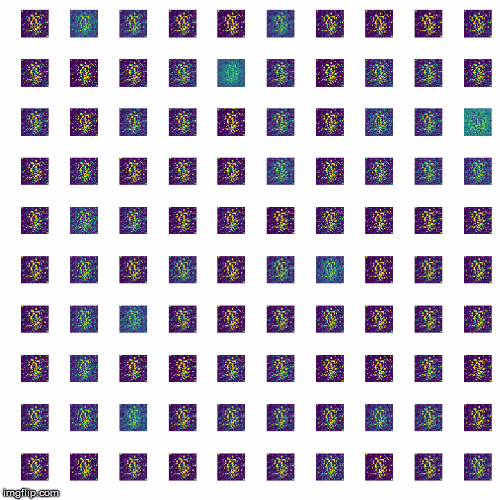

# Fake_image_generator

Generate fake MNIST dataset using GANs
In this project we are going to generate fake MNIST hand written digits dataset. This is very basic project for getting started with GANs.

## Introduction
- **What are GANs?**
    
    Generative Adversarial Networks or GANs are a new type of neural architectures introduced by Ian Goodfellow and other researchers at the University of Montreal, including Yoshua Bengio, in June 2014.
    
    GANs have been called the most interesting idea of the decade by Facebook’s AI research director Yann LeCun.
    
    GANs are based on the idea of adversarial training. They basically consist of two neural networks which compete against each other. This competitiveness helps them to mimic any distribution of data. Their ability to mimic data makes them just like a robo artist, as once trained successfully GANs are able to create pieces of art, songs, images, and even videos.
- **How GANs Work**

    One neural network, called the generator, generates new data instances, while the other, the discriminator, evaluates them for authenticity; i.e. the discriminator decides whether each instance of data that it reviews belongs to the actual training dataset or not.
Let’s say we’re trying to do something more banal than mimic the Mona Lisa. We’re going to generate hand-written numerals like those found in the MNIST dataset, which is taken from the real world. The goal of the discriminator, when shown an instance from the true MNIST dataset, is to recognize those that are authentic.
Meanwhile, the generator is creating new, synthetic images that it passes to the discriminator. It does so in the hopes that they, too, will be deemed authentic, even though they are fake. The goal of the generator is to generate passable hand-written digits: to lie without being caught. The goal of the discriminator is to identify images coming from the generator as fake.

    Here are the steps a GAN takes:

    - The generator takes in random numbers and returns an image.
    - This generated image is fed into the discriminator alongside a stream of images taken from the actual, ground-truth dataset.
    - The discriminator takes in both real and fake images and returns probabilities, a number between 0 and 1, with 1 representing a prediction of authenticity and 0 representing fake.

    So you have a double feedback loop:
    - The discriminator is in a feedback loop with the ground truth of the images, which we know.
    - The generator is in a feedback loop with the discriminator.
    
    
                            GAN schema Credit: O’Reilly
    
    You can think of a GAN as the opposition of a counterfeiter and a cop in a game of cat and mouse, where the counterfeiter is learning to pass false notes, and the cop is learning to detect them. Both are dynamic; i.e. the cop is in training, too (to extend the analogy, maybe the central bank is flagging bills that slipped through), and each side comes to learn the other’s methods in a constant escalation.
    
    For MNIST, the discriminator network is a standard convolutional network that can categorize the images fed to it, a binomial classifier labeling images as real or fake. The generator is an inverse convolutional network, in a sense: While a standard convolutional classifier takes an image and downsamples it to produce a probability, the generator takes a vector of random noise and upsamples it to an image. The first throws away data through downsampling techniques like maxpooling, and the second generates new data.
    
    Both nets are trying to optimize a different and opposing objective function, or loss function, in a zero-zum game. This is essentially an actor-critic model. As the discriminator changes its behavior, so does the generator, and vice versa. Their losses push against each other.
    
                        GANs Image credit: Thalles Silva

## Requirements:
- numpy
- pandas
- matplotlib
- tqdm
- keras with tensorflow as backend
- GPU availability is a big plus.

### Steps to run it on your system:

**Note:** I am using Ubuntu 18.04 with anaconda environment and python-3.6.8

1. Get this project to your local system
	>git clone https://github.com/Sonkaryasshu/Fake_Image_Generation.git
2. Change directory to current project
	>cd fake_image_generation

3. Create virtual environment ***[Optional]***  
Using Anaconda here( You may use python venv)
**Note:** Use tensorflow as backend in keras
- Use the terminal or an Anaconda Prompt for the following steps:

	> conda create -n myenv python=3.6.8

- Activate the new environment:

	> conda activate myenv

4. Run the python file

	> python main.py

	**Note:** If you have created a virtual environment , you may leave it by running
	>conda deactivate
### Sample output
After running the `python main.py` command, our GAN model will start training on MNIST dataset and after each 20 steps model will save sample output of our generator. After completing the training for 400 epoches, you can see the sample images generated.

**Visualization of training**

.
